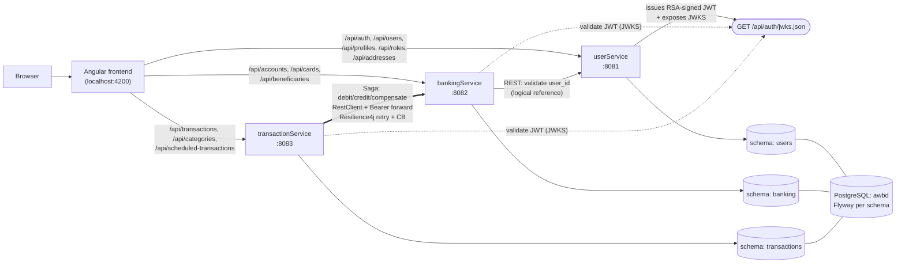
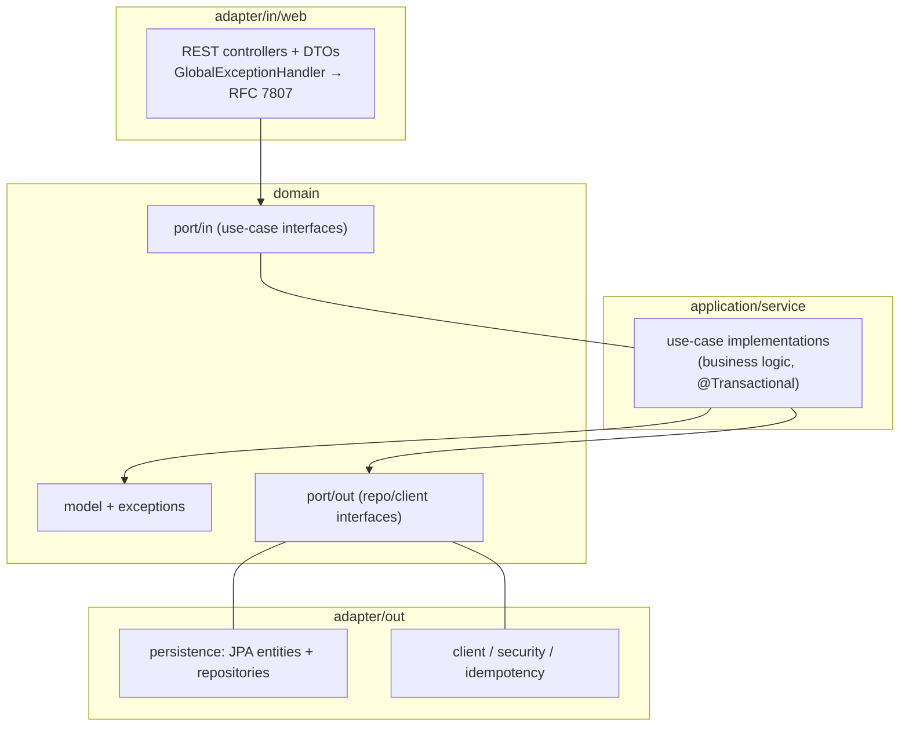
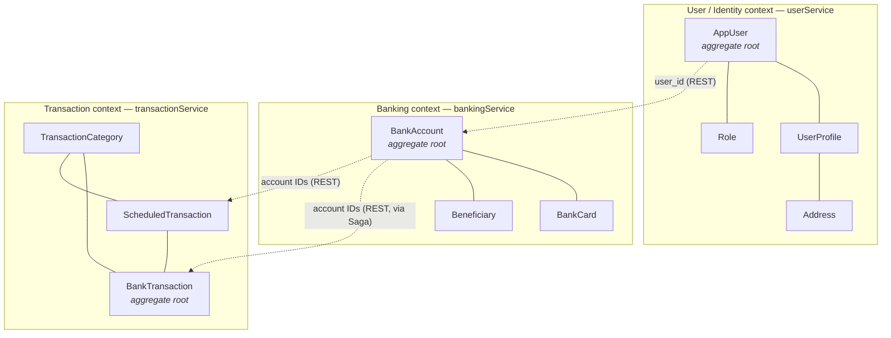
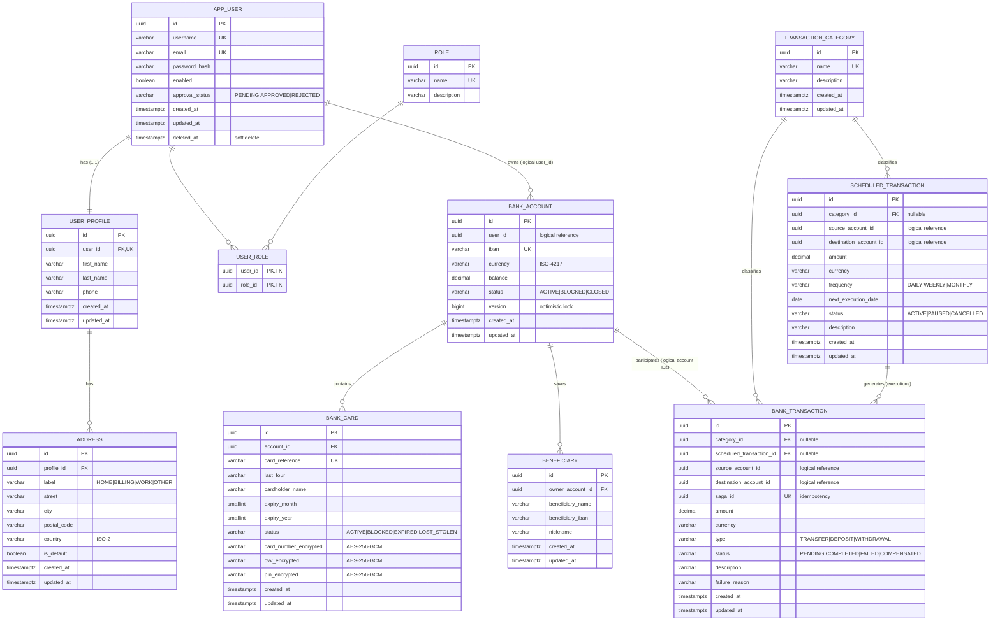

# proiect_AWBD

Backend-focused banking coursework project built as three independent Spring Boot 4.1 microservices (Java 25) and one Angular frontend.

> Status: the backend is implemented — the three services expose full CRUD, JWT-based security, Flyway-managed schemas, the transfer Saga and Resilience4j.

## Components

| Component | Port | Responsibility | Owned entities |
|---|---|---|---|
| `userService` | 8081 | Authentication (JDBC + JWT issuance), users, profiles, roles, addresses | `AppUser`, `UserProfile`, `Role`, `Address` |
| `bankingService` | 8082 | Bank accounts, cards and saved beneficiaries; validates userService JWTs | `BankAccount`, `BankCard`, `Beneficiary` |
| `transactionService` | 8083 | Transfers (Saga), transaction classification and recurring transfers | `BankTransaction`, `TransactionCategory`, `ScheduledTransaction` |
| `frontend` | 4200 | Angular login, CRUD pages, validation and pagination | No database |

The three services share a single PostgreSQL database (`awbd`), each owning a **separate schema** — `users`, `banking`, `transactions` — never crossing schema boundaries with a FK or a shared connection.

Detailed documents:

- [Backend architecture](docs/BACKEND_ARCHITECTURE.md)
- [Database architecture](docs/DATABASE_ARCHITECTURE.md)
- [User database SQL](database/user-service-schema.sql)
- [Banking database SQL](database/banking-service-schema.sql)
- [Transaction database SQL](database/transaction-service-schema.sql)

## Backend architecture

Current, implemented topology. Callers hit each service's port directly (no gateway/Ingress yet); every service is a stateless resource server that validates the RSA-signed JWT issued by `userService`.

Each service owns its schema and never reads another service's tables directly; cross-service links (`user_id`, account IDs) are logical references checked over REST. `userService` is the sole authentication authority — `bankingService` and `transactionService` validate tokens against its public JWKS endpoint. The `transactionService → bankingService` transfer leg forwards the caller's Bearer token and is wrapped in Resilience4j retry + circuit breaker.

### Hexagonal layering (identical in all three services)

Controllers never accept or return JPA entities — only DTOs, translated by a mapper. Domain exceptions become RFC 7807 `ProblemDetail` responses (400 validation, 404 not found, 409 conflict, 401/403 auth, 500 fallback).

## Conceptual diagram — bounded contexts

High-level domain view: three bounded contexts, each around its aggregate roots, connected only by logical references over REST.

## ER diagram — 10 interconnected entities

Fields below match the JPA entities and Flyway migrations. `//` marks the schema each entity lives in.

- **`users` schema:** `APP_USER`, `USER_PROFILE`, `ROLE`, `USER_ROLE` (join table for the `AppUser` ↔ `Role` many-to-many), `ADDRESS`. A `persistent_logins` table (remember-me) also lives here but is managed directly by Spring Security, not a JPA entity.
- **`banking` schema:** `BANK_ACCOUNT`, `BANK_CARD`, `BENEFICIARY`.
- **`transactions` schema:** `BANK_TRANSACTION`, `TRANSACTION_CATEGORY`, `SCHEDULED_TRANSACTION`.

Physical foreign keys exist only inside a single schema. `BANK_ACCOUNT.user_id`, `BANK_TRANSACTION.source_account_id`/`destination_account_id`, and `SCHEDULED_TRANSACTION.source_account_id`/`destination_account_id` are logical references validated through REST APIs, not database foreign keys.

### Required JPA relationship examples

| Requirement | Implementation |
|---|---|
| `@OneToOne` | `AppUser` ↔ `UserProfile` |
| `@OneToMany / @ManyToOne` | `BankAccount` ↔ `BankCard`, `BankAccount` ↔ `Beneficiary`, `UserProfile` ↔ `Address`, `TransactionCategory` ↔ `BankTransaction`, `TransactionCategory` ↔ `ScheduledTransaction`, `ScheduledTransaction` ↔ `BankTransaction` |
| `@ManyToMany` | `AppUser` ↔ `Role`, using `user_roles` |

## Grading implementation map

| Requirement | Minimal implementation that demonstrates it |
|---|---|
| Complete CRUD | Controller → service → Spring Data JPA repository for all ten entities; DTOs prevent exposing JPA entities |
| Exceptions | RFC 7807 `ProblemDetail`: 400 validation, 404 read/update/delete missing, 409 duplicate or unsafe delete, 500 fallback |
| Multi-environment | `application-dev.yml` with PostgreSQL and `application-test.yml` with H2 for every service |
| Testing | JUnit 5 + Mockito service tests (70%+ service coverage), plus one integration scenario per microservice |
| Angular views | Login plus list/create/edit/details/delete pages; reactive forms and custom 404/500 routes |
| Validation | Bean Validation in request DTOs and matching Angular validators/messages |
| Logging | SLF4J and `logback-spring.xml`; normal and error log files; correlation ID propagated between services |
| Pagination | Users, accounts and transactions; default 20, maximum 100, two or more allowed sort fields each |
| Security | JDBC-backed authentication, BCrypt, `USER`/`ADMIN`, JWT propagation, CSRF cookie/header, logout and remember-me option |
| Resilience | Resilience4j circuit breaker, retry and fallback on the transaction→banking transfer leg |
| Pattern | Saga orchestration for transfers with a compensating credit when a later step fails |

