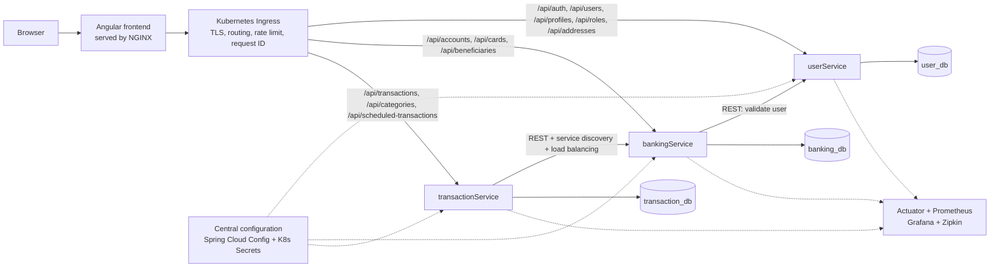
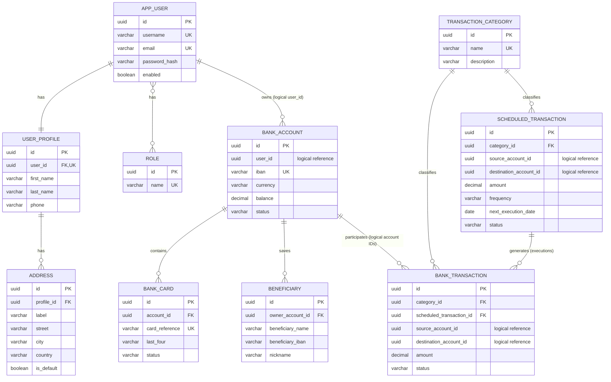

# proiect_AWBD

Backend-focused banking coursework project built as three independent Spring Boot microservices and one Angular frontend.

> Status: this repository currently contains the initial Spring Boot skeletons. The documents and SQL files below define the target architecture to implement.

## Components

| Component | Responsibility | Owned entities |
|---|---|---|
| `userService` | Authentication, users, profiles, roles and addresses | `AppUser`, `UserProfile`, `Role`, `Address` |
| `bankingService` | Bank accounts, cards and saved beneficiaries | `BankAccount`, `BankCard`, `Beneficiary` |
| `transactionService` | Transfers, transaction classification and recurring transfers | `BankTransaction`, `TransactionCategory`, `ScheduledTransaction` |
| `frontend` | Angular login, CRUD pages, validation and pagination | No database |

Detailed documents:

- [Backend architecture](docs/BACKEND_ARCHITECTURE.md)
- [Database architecture](docs/DATABASE_ARCHITECTURE.md)
- [User database SQL](database/user-service-schema.sql)
- [Banking database SQL](database/banking-service-schema.sql)
- [Transaction database SQL](database/transaction-service-schema.sql)

## Backend architecture

Each service owns its database. A service never reads another service's tables directly.

## ER diagram — 10 interconnected entities

Physical foreign keys exist only inside a service boundary. `BANK_ACCOUNT.user_id`, `BANK_TRANSACTION.source_account_id`/`destination_account_id`, and `SCHEDULED_TRANSACTION.source_account_id`/`destination_account_id` are logical references checked through REST APIs.

### Required JPA relationship examples

| Requirement | Implementation |
|---|---|
| `@OneToOne` | `AppUser` ↔ `UserProfile` |
| `@OneToMany / @ManyToOne` | `BankAccount` ↔ `BankCard`, `BankAccount` ↔ `Beneficiary`, `UserProfile` ↔ `Address`, `TransactionCategory` ↔ `BankTransaction`, `TransactionCategory` ↔ `ScheduledTransaction`, `ScheduledTransaction` ↔ `BankTransaction` |
| `@ManyToMany` | `AppUser` ↔ `Role`, using `user_roles` |

## Grading implementation map

| Requirement | Minimal implementation that demonstrates it |
|---|---|
| Complete CRUD | Controller → service → Spring Data JPA repository for all ten entities; DTOs prevent exposing JPA entities |
| Exceptions | RFC 7807 `ProblemDetail`: 400 validation, 404 read/update/delete missing, 409 duplicate or unsafe delete, 500 fallback |
| Multi-environment | `application-dev.yml` with PostgreSQL and `application-test.yml` with H2 for every service |
| Testing | JUnit 5 + Mockito service tests (70%+ service coverage), plus one integration scenario per microservice |
| Angular views | Login plus list/create/edit/details/delete pages; reactive forms and custom 404/500 routes |
| Validation | Bean Validation in request DTOs and matching Angular validators/messages |
| Logging | SLF4J and `logback-spring.xml`; normal and error log files; correlation ID propagated between services |
| Pagination | Users, accounts and transactions; default 20, maximum 100, two or more allowed sort fields each |
| Security | JDBC-backed authentication, BCrypt, `USER`/`ADMIN`, JWT propagation, CSRF cookie/header, logout and remember-me option |
| Central config | Spring Cloud Config deployed in Kubernetes; sensitive values come from Kubernetes Secrets; `/actuator/refresh` demo |
| Discovery and REST | Kubernetes service names + Spring Cloud Kubernetes Discovery; load-balanced `RestTemplate` calls |
| Scaling | Two replicas for each business service; pod name returned in a diagnostic response header for demonstration |
| API Gateway | Kubernetes Ingress for central routing, rate limiting, request ID and security headers |
| Monitoring | Actuator health/metrics, Prometheus scraping, Grafana dashboard and Zipkin tracing |
| Resilience | Resilience4j circuit breaker, retry and fallback on transaction→banking and banking→user calls |
| Pattern | Saga orchestration for transfers with a compensating credit when a later step fails |
| CI/CD | GitHub Actions: test, package, Docker build/push, deploy to a staging namespace |
| AI agents | Optional backlog only; implement after the graded backend and DevOps requirements are complete |

## Recommended implementation order

1. Implement the ten entities, Flyway migrations and CRUD endpoints.
2. Add validation, exceptions, profiles, tests, pagination, sorting, logging and security.
3. Build the small Angular CRUD frontend.
4. Add Dockerfiles, Kubernetes manifests, Ingress, configuration and two replicas.
5. Add resilience, Saga behavior, monitoring/tracing and CI/CD.
6. Add an AI feature only if time remains.

