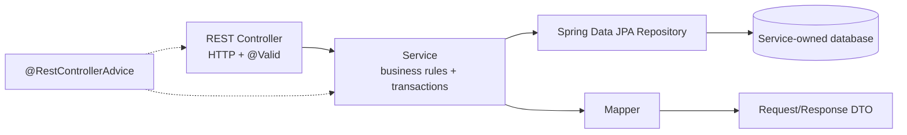
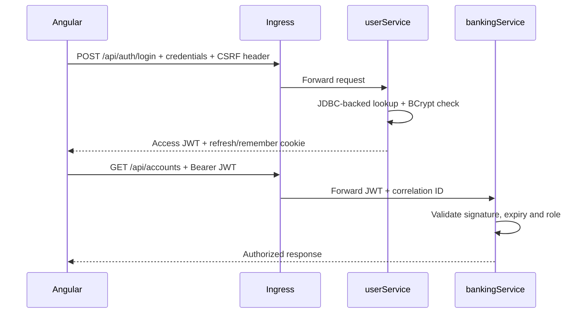
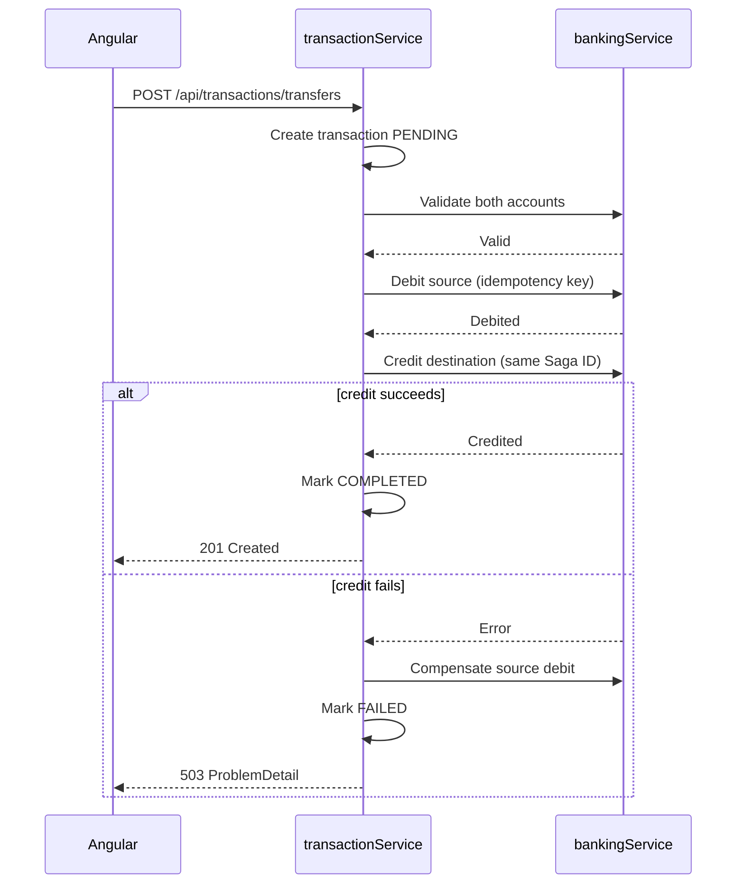

# Backend architecture

## 1. Design goal

The design deliberately keeps the business domain small while exposing every feature required by the rubric. There are exactly three business microservices and ten persistent entities. Infrastructure components such as Ingress, Config Server, Prometheus and Zipkin do not count as business microservices.

## 2. Service boundaries

### userService

Responsibilities:

- register and administer users;
- authenticate credentials stored in PostgreSQL;
- encode passwords with BCrypt;
- issue and validate JWT access tokens;
- manage profiles, roles and addresses;
- expose a lightweight user-existence endpoint for `bankingService`.

Entities: `AppUser`, `UserProfile`, `Role`, `Address`.

Suggested packages:

```text
userService.demo
├── config
├── controller
├── dto
├── entity
├── exception
├── mapper
├── repository
├── security
└── service
```

### bankingService

Responsibilities:

- manage accounts, cards and saved beneficiaries;
- verify the logical account owner through `userService`;
- expose balance operations used by the transfer Saga;
- never store full card PAN or CVV.

Entities: `BankAccount`, `BankCard`, `Beneficiary`.

### transactionService

Responsibilities:

- manage transactions, categories and scheduled/recurring transfers;
- orchestrate transfers, including executions spawned from a `ScheduledTransaction`;
- call `bankingService` through a discovered, load-balanced REST client;
- apply retry, circuit breaker and fallback behavior.

Entities: `BankTransaction`, `TransactionCategory`, `ScheduledTransaction`.

## 3. Layering used by every service



Rules:

- controllers only translate HTTP requests and responses;
- service classes own business logic and transaction boundaries;
- repositories contain persistence queries only;
- request and response DTOs isolate the API from JPA models;
- `@RestControllerAdvice` produces RFC 7807 `ProblemDetail` responses;
- entities are never accepted directly from Angular.

## 4. REST API surface

All collection endpoints support `GET`, `POST`; item endpoints support `GET`, `PUT`, `DELETE`. `PATCH` may be added but is not needed for the CRUD mark.

| Service | Resource endpoints | Roles |
|---|---|---|
| user | `/api/users`, `/api/profiles`, `/api/roles`, `/api/addresses` | reads: USER/ADMIN; writes: ADMIN, except own profile/addresses |
| user | `/api/auth/login`, `/api/auth/logout`, `/api/auth/refresh` | public/authenticated as appropriate |
| banking | `/api/accounts`, `/api/cards`, `/api/beneficiaries` | USER owns resources; ADMIN can manage all |
| transaction | `/api/transactions`, `/api/categories`, `/api/scheduled-transactions` | USER owns transactions/schedules; category writes ADMIN |

Internal endpoints should live under `/internal/**`, require a service JWT, and not be routed publicly by Ingress:

- `GET /internal/users/{id}/exists`
- `POST /internal/accounts/{id}/debit`
- `POST /internal/accounts/{id}/credit`
- `POST /internal/accounts/{id}/compensate`

Use an `Idempotency-Key` header for debit, credit and compensation operations.

## 5. Pagination and sorting

Implement Spring `Pageable` for the following three entities first:

| Entity | Default sort | Allowed sort fields |
|---|---|---|
| AppUser | `createdAt,desc` | `username`, `email`, `createdAt` |
| BankAccount | `createdAt,desc` | `iban`, `balance`, `createdAt` |
| BankTransaction | `createdAt,desc` | `createdAt`, `amount`, `status` |

Use `page=0&size=20&sort=createdAt,desc`, cap `size` at 100, and reject unknown sort properties with HTTP 400. Angular shows previous/next buttons, current page, total pages and a page-size selector.

## 6. Validation and exception contract

Examples of server-side validation:

- username: required, 3–50 characters;
- email: required and valid email;
- password: minimum 8 characters;
- IBAN: required and syntactically valid;
- currency: exactly three uppercase letters;
- amount: greater than zero;
- source and destination accounts: different;
- card expiry: not in the past.

Standard errors:

| Operation | Example | HTTP status |
|---|---|---:|
| Create | duplicate username, email or IBAN | 409 |
| Read | entity ID does not exist | 404 |
| Update | invalid state or missing ID | 400 / 404 |
| Delete | referenced resource cannot be deleted | 409 |
| Validation | invalid request DTO | 400 |
| Unexpected | unhandled server error with trace ID | 500 |

Angular displays the backend `detail` message beside the form and routes unknown pages to a custom 404 component. A global HTTP interceptor handles 401, 403 and 500 consistently.

## 7. Angular frontend architecture

Use one Angular application with feature folders and reactive forms. Do not add NgRx; service classes plus RxJS are sufficient for this project.

```text
frontend/src/app
├── core
│   ├── auth
│   ├── guards
│   └── interceptors
├── shared
│   ├── components
│   └── models
├── features
│   ├── users
│   ├── roles
│   ├── profiles
│   ├── addresses
│   ├── accounts
│   ├── cards
│   ├── beneficiaries
│   ├── transactions
│   ├── categories
│   └── scheduled-transactions
└── errors
    ├── not-found
    └── server-error
```

Each feature uses the same small pattern: list component, reusable reactive form component, details component and API service. The list page owns pagination/sorting controls; create and edit reuse the same form. Route guards enforce authenticated/admin pages, an auth interceptor adds the JWT, and an error interceptor presents friendly messages.

Suggested routes:

- `/login`;
- `/users`, `/roles`, `/profiles`, `/profiles/:id/addresses` for administration;
- `/accounts`, `/accounts/:id/cards`, `/accounts/:id/beneficiaries`;
- `/transactions`, `/transactions/new`, `/categories`, `/scheduled-transactions`;
- `/403`, `/404`, `/500`.

## 8. Security flow



- roles: `ROLE_USER`, `ROLE_ADMIN`;
- authentication data is stored in `user_db` and loaded by `JdbcUserDetailsManager` with custom user and authority SQL queries; JPA remains responsible for CRUD;
- access JWT is short lived; remember-me selects a longer refresh-cookie lifetime;
- password hashes use BCrypt;
- JWT is validated by every microservice, not trusted solely because traffic came from Ingress;
- CSRF uses `CookieCsrfTokenRepository`; Angular sends the `X-XSRF-TOKEN` header;
- logout invalidates the refresh/remember cookie and clears authentication cookies;
- production cookies are `Secure`, `HttpOnly` where applicable, and `SameSite=Lax` or stricter.

## 9. Transfer Saga

`transactionService` is the Saga orchestrator. The implementation remains synchronous and REST-based so Kafka is not required.



Document the Saga ID, idempotency key and state changes in logs. Resilience4j protects both `transactionService → bankingService` and `bankingService → userService` calls with timeouts, retry for transient failures, circuit breaker and explicit fallbacks.

## 10. Configuration, discovery and scaling

- Central non-secret properties are served by Spring Cloud Config.
- Passwords and JWT signing material are injected from Kubernetes Secrets.
- Each service exposes `/actuator/refresh` only on the internal management network; a demo changes one property without restarting the pod.
- Spring Cloud Kubernetes Discovery resolves services by name.
- A load-balanced `RestTemplate` performs internal calls using names such as `http://banking-service`.
- Kubernetes Deployments use two replicas for each business service.
- A diagnostic `X-Instance-Id` response header (pod name) makes load distribution easy to demonstrate.
- Readiness and liveness probes use Actuator health groups.

## 11. Ingress and observability

Ingress responsibilities:

- route frontend and API paths;
- terminate TLS when enabled;
- rate-limit API calls;
- add or propagate `X-Correlation-ID`;
- add basic response security headers;
- never expose `/internal/**`.

Every service includes Actuator, Micrometer Prometheus registry and Micrometer Tracing. Prometheus scrapes metrics, Grafana visualizes CPU/memory/request count/latency/error rate, and Zipkin shows traces across service calls.

SLF4J logs use MDC fields `correlationId`, `traceId`, `userId` (when known) and `service`. `logback-spring.xml` writes normal application logs and ERROR logs to separate rolling files. Passwords, tokens, PAN/CVV and other sensitive data must never be logged.

## 12. Testing strategy

Unit tests use JUnit 5 and Mockito and target at least 70% line coverage for each service layer. JaCoCo fails the build if the agreed service-layer threshold is missed.

Minimum integration scenarios using the `test` profile and H2:

1. `userService`: create user → assign role → add address → authenticate.
2. `bankingService`: create account → create card → add beneficiary → list cards with pagination.
3. `transactionService`: create category → submit transfer → verify final status while downstream calls are stubbed with WireMock.
4. `transactionService`: create scheduled transaction → simulate due execution → verify a linked `BankTransaction` is produced.

Also add tests for validation failures, unauthorized access, missing resources, duplicates and Saga compensation.

## 13. CI/CD and implementation phases

GitHub Actions jobs:

1. test the three Maven services in a matrix;
2. test and build Angular;
3. build Docker images;
4. push tagged images to GHCR;
5. deploy to a Kubernetes `staging` namespace after tests pass;
6. run smoke checks against Actuator health and one public endpoint.

AI-agent development/runtime features remain optional backlog items until the backend, tests and DevOps demonstration are complete.
