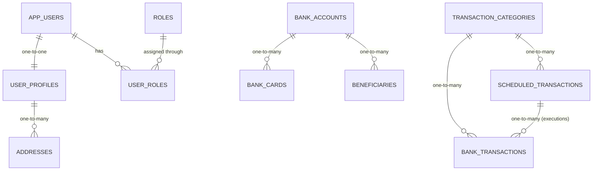

# SQL and data architecture

## 1. Database-per-service

Development uses one PostgreSQL server with three databases. This is operationally simple while preserving microservice ownership:

| Database | Owner | Tables |
|---|---|---|
| `user_db` | `userService` | `app_users`, `user_profiles`, `roles`, `addresses`, `user_roles` |
| `banking_db` | `bankingService` | `bank_accounts`, `bank_cards`, `beneficiaries` |
| `transaction_db` | `transactionService` | `transaction_categories`, `bank_transactions`, `scheduled_transactions` |

The join table `user_roles` implements a relationship and is not counted as a domain entity. Therefore the model contains exactly ten JPA entities.

For tests, every service uses its own H2 in-memory database through `application-test.yml`. Use `MODE=PostgreSQL` where useful, but keep entity mappings portable.

## 2. Physical relationships



Only these relationships use SQL foreign keys and JPA relationship annotations. Cross-service references use UUID columns with no SQL foreign key:

- `bank_accounts.user_id` → logical `userService` user ID;
- `beneficiaries.beneficiary_iban` → logical external/`bankingService` IBAN, not a foreign key;
- `bank_transactions.source_account_id` / `scheduled_transactions.source_account_id` → logical `bankingService` account ID;
- `bank_transactions.destination_account_id` / `scheduled_transactions.destination_account_id` → logical `bankingService` account ID.

The owning service validates logical references via REST. This prevents one microservice from depending on another microservice's schema.

## 3. JPA ownership

| Relationship | Owning side | Inverse side | Important mapping detail |
|---|---|---|---|
| AppUser ↔ UserProfile | `UserProfile.user` | `AppUser.profile` | `@JoinColumn(unique = true)`, cascade + orphan removal from user |
| AppUser ↔ Role | `AppUser.roles` | `Role.users` | `@JoinTable(name = "user_roles")`; avoid cascading deletes to roles |
| UserProfile ↔ Address | `Address.profile` | `UserProfile.addresses` | address has the FK; cascade + orphan removal from profile |
| BankAccount ↔ BankCard | `BankCard.account` | *(none — unidirectional)* | card has the FK; DB-level `ON DELETE CASCADE`. No inverse `@OneToMany` in `bankingService`'s implementation: combining an inverse collection with `orphanRemoval` proved unsafe once a hexagonal persistence mapper rebuilds the parent entity on every save, since Hibernate then deletes any child not present in that rebuilt (empty) collection |
| BankAccount ↔ Beneficiary | `Beneficiary.ownerAccount` | *(none — unidirectional)* | beneficiary has the FK; DB-level `ON DELETE CASCADE`; same rationale as above |
| TransactionCategory ↔ BankTransaction | `BankTransaction.category` | `TransactionCategory.transactions` | block category deletion while referenced |
| TransactionCategory ↔ ScheduledTransaction | `ScheduledTransaction.category` | `TransactionCategory.schedules` | block category deletion while referenced |
| ScheduledTransaction ↔ BankTransaction | `BankTransaction.scheduledTransaction` | `ScheduledTransaction.executions` | nullable FK; `ON DELETE SET NULL` keeps execution history after a schedule is removed |

Use DTOs or Jackson ignore annotations to prevent infinite recursion. Prefer DTOs.

## 4. Money and consistency rules

- Store monetary values as `NUMERIC(19,2)` and map to Java `BigDecimal`, never `double`.
- Use three-letter ISO currency codes.
- Add `@Version`/`version` to accounts to prevent lost balance updates.
- Debit and credit execute in database transactions inside `bankingService`.
- Require a unique idempotency key for every balance-changing operation during implementation.
- Never persist CVV or the full card number; store only a generated card reference and last four digits.
- Store all timestamps in UTC using `TIMESTAMPTZ`.

## 5. Schema management

Use Flyway migrations in each service:

```text
src/main/resources/db/migration/
└── V1__initial_schema.sql
```

Recommended settings:

- development: Flyway enabled, `spring.jpa.hibernate.ddl-auto=validate`;
- test: Flyway enabled against H2 where possible, otherwise `create-drop` only for focused repository tests;
- production/staging: Flyway enabled, never use `ddl-auto=create` or `update`.

The SQL files in `/database` are the reference design. Copy the relevant statements into each service's Flyway migration when implementation begins.

## 6. Profile layout

Each service should have:

```text
application.yml
application-dev.yml
application-test.yml
```

- `application.yml`: common service name, actuator and pagination defaults;
- `application-dev.yml`: PostgreSQL URL/credentials supplied through environment variables;
- `application-test.yml`: isolated H2 URL and test-only security values.

Do not commit real passwords or signing keys. Commit only placeholders such as `${DB_PASSWORD}` and provide secrets through the environment or Kubernetes Secrets.

